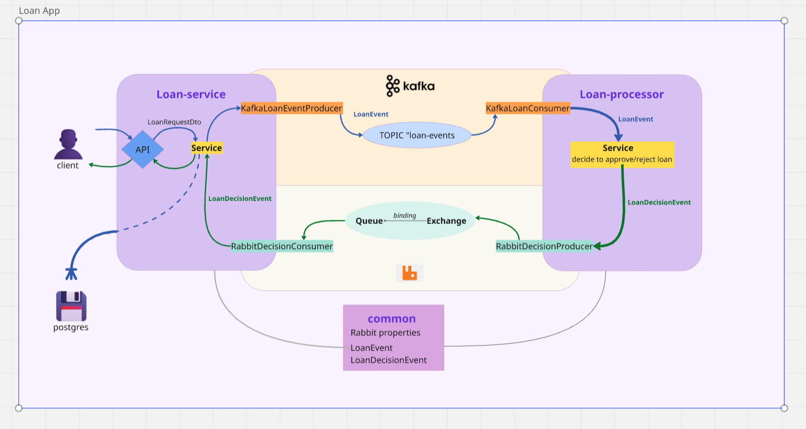

## Tools:

· Intellij IDEA
· Kafka
· RabbitMQ
· RDBMS на выбор
· Docker
· http-клиент

## Materials:

https://www.baeldung.com/rabbitmq
https://www.baeldung.com/spring-kafka

# Task Description

You need to create two microservices that exchange data with each other using message brokers: RabbitMQ and Kafka.
For example, the first service will send a message to the second service via Kafka, and the second service will send a
response back to the first service via RabbitMQ.
A REST request to a controller will serve as the trigger to send the message. Kafka and RabbitMQ must be deployed using
Docker and docker-compose.

## Instructions

1) Create a microservice – an API for submitting a loan application.
   A loan application must include: loan amount, loan term, user income, current debt load, and current credit rating. *
   Использовать RestController для получения и обработки запроса из spring-boot-starter-web

- Use a @RestController (from spring-boot-starter-web) to receive and handle the request.
- Upon receiving an application, the service should:

   * Save it to the database.
   * Send it to the loan-processing service via Kafka.
   * Return the database record’s ID to the user.

- In the database, include a field for the application’s status (IN_PROGRESS/APPROVED/REJECTED). The default status on
  insert should be “IN_PROGRESS.”
- Add a second API endpoint to retrieve the status by application ID.
- Receive the processing service’s response via RabbitMQ.
- When processing the response, update the application’s status in the database.
- Provide a migration mechanism (e.g., Liquibase or Flyway) for schema setup.
- Use dedicated event classes (e.g., suffix Event) for messaging; do not forward the user’s DTOs directly.

2) Create the loan-processing microservice.

- Consume the loan application event via Kafka.
- Decide whether to approve the loan (monthly payment must not exceed 50% of income).
- Send back a decision event via RabbitMQ.

3) Add a docker-compose.yml to deploy all components (Postgres, Kafka, RabbitMQ, both services).

4) Provide an HTTP client file (e.g., .http or Postman collection) containing requests to submit a loan application and
   to check its status.

## Shema

https://miro.com/app/board/uXjVLKPM7aI=/